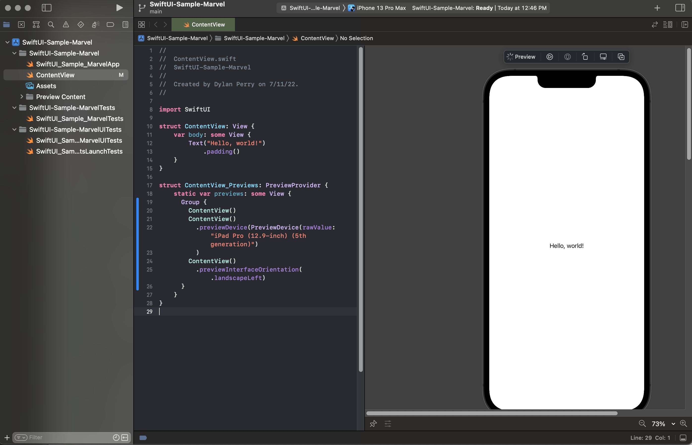
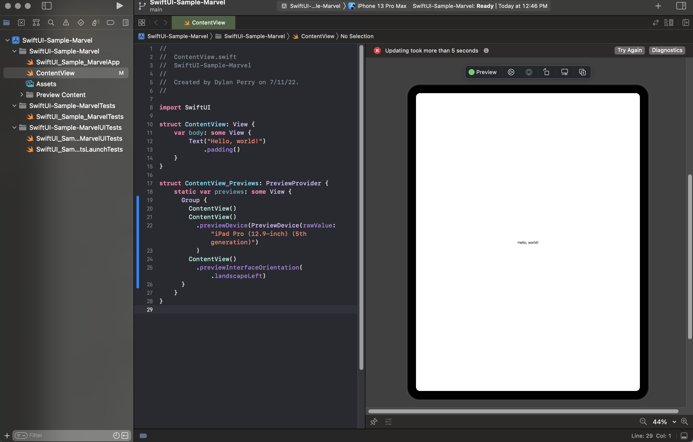
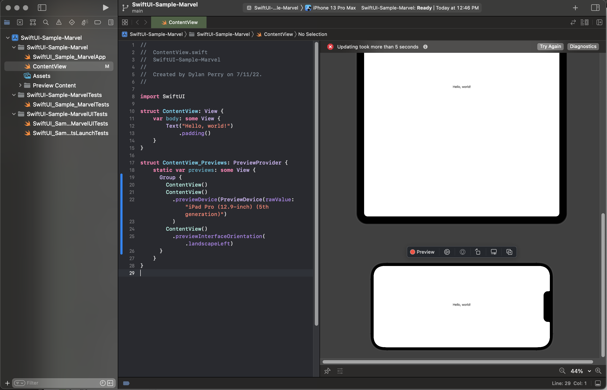

# SwiftUI Preview

## What is Preview?

When you create a SwiftUI `View`, the IDE can display a preview of the view that updates as the code updates. In order for this to work, you must define a struct that conforms to the `PreviewProvider` protocol.

The `Preview` can be further configured using preview-sepecific modifiers such as `previewDevice(_:)` and `previewInterfaceOrientation(:_)`.

## The PreviewProvider Protocol

The struct must conform to this protocol in order for the preview to be shown. Typically, when defining your PreviewProvider, the naming convention is to append an "_Previews" to your view. If your view is named `DylansView`, the name of your preview would typiclly be `DylansView_Previews`.

If no device is defined via `previewDevice(_:)` modifier on your view, then the default preview will be whatever device is targetted with the current run destination.

    - Sample Code:
        - ```swift
            struct ContentView_Previews: PreviewProvider {
                static var previews: some View {
                    Group {
                        ContentView()

                        ContentView()
                            .previewDevice(
                                PreviewDevice(rawValue: "iPad Pro (12.9-inch) (5th generation)")
                            )

                        ContentView()
                            .previewInterfaceOrientation(.landscapeLeft)
                    }
                }
            }
        ```

#### Default preview
- Sample Code:
    - ```swift
        ContentView()
    ```
- Resuting Preview:
    - 

#### previewDevice(_:)

Notice when you add the code below, on your preview you will see the device change. 

- Sample Code:
    - ```swift
        ContentView()
            .previewDevice(
                PreviewDevice(rawValue: "iPad Pro (12.9-inch) (5th generation)")
            )
    ```
- Resuting Preview:
    - 


#### previewDevice(_:)
Notice when you add the code below, your preview's orientation will change.

- Sample Code:
    - ```swift
        ContentView()
            .previewInterfaceOrientation(.landscapeLeft)
    ```

- Resulting Preview:
    - 


### More to come

### Sources
1. [Works Cited](sources.md)