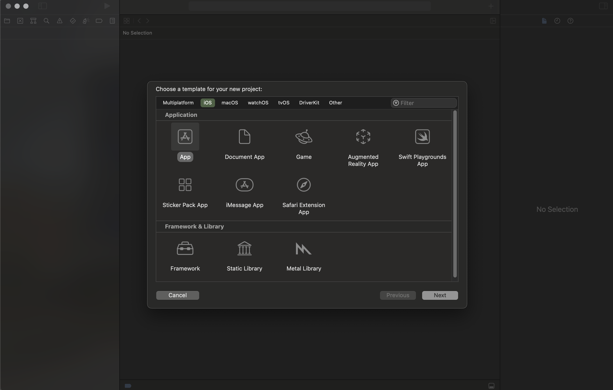
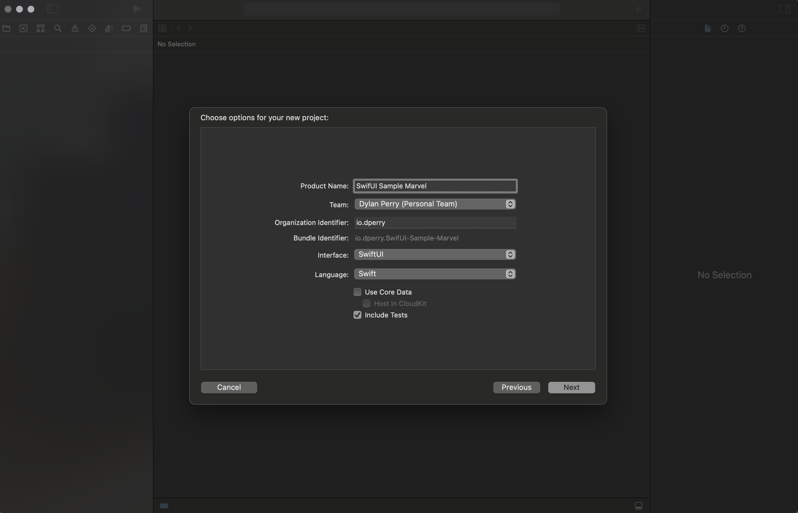
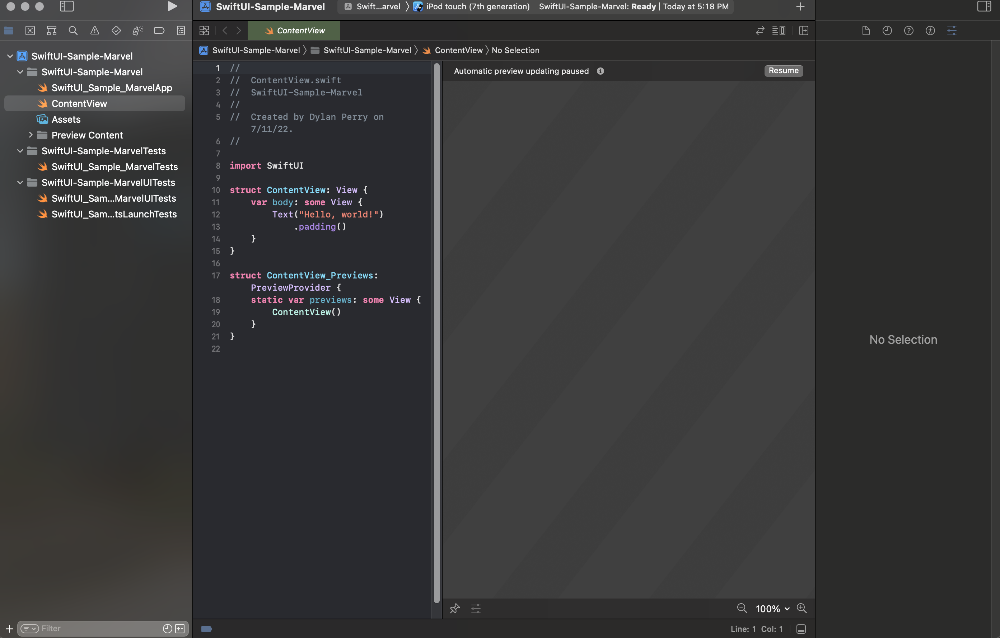
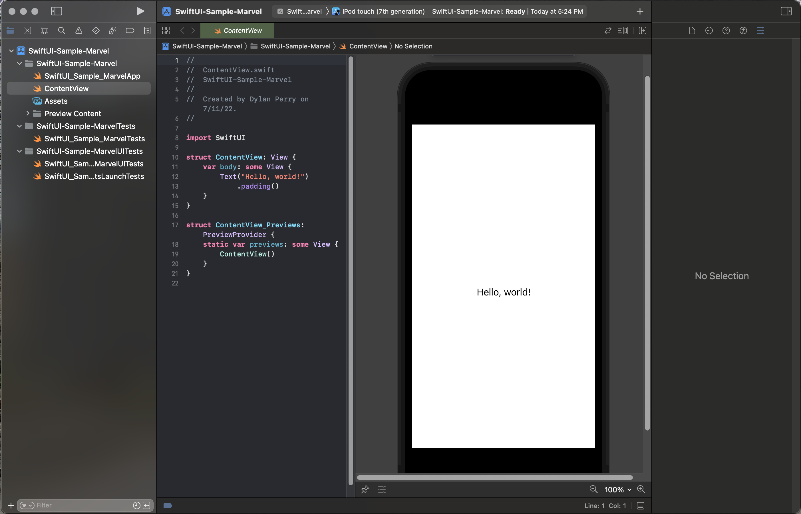

# App Creation

## How to Create the App?

1. File --> New Project
2. Select "App" as the kind of application to create.
    - 
3. Now we specify things about our application.
    - Give it a name, I chose "SwiftUI Sample Marvel".
    - For identifier, you can put anything. I chose "io.dperry"
    - Make sure that in the **interface** dropwdown you select `SwiftUI`.
    - Make sure that in the **language** dropdown, you select `Swift`.
    - 
4. Voila! You have created a brand new SwiftUI Application! 

## Check out a "Preview"

1. When your app first launches, it will look something like this:
    - 

2. One of the coolest parts of SwiftUI is the ability to see a [Preview](Preview/index.md) inside the IDE. To see this in action, click "Resume" on the right side.
    - If you don't see the above screen with the "resume" option. At the top of your screen go into the `Editor` option in the app bar and select `Canvas`. Editor -> Canvas.
    - 
3. When it comes to Previews, the most important snippet of code is below:
    - ```swift
        struct ContentView_Previews: PreviewProvider {
            static var previews: some View {
                ContentView()
            }
        }
        ```
    -  Pay special attention to the [PreviewProvider Protocol](Preview/index.md). This is what enables the IDE to know what we want to present in the Preview. Any SwiftUI View can be viewed in a preview, based on what you do in this `PreviewProvider` piece of the code.

