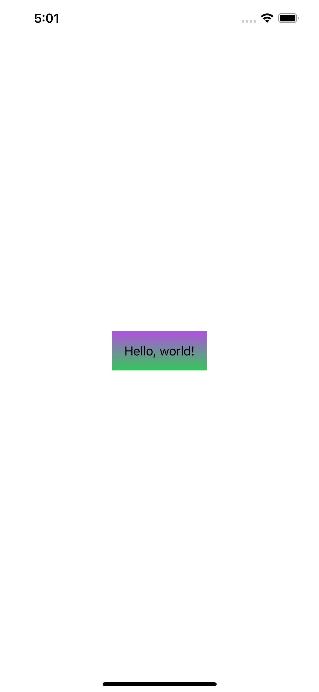
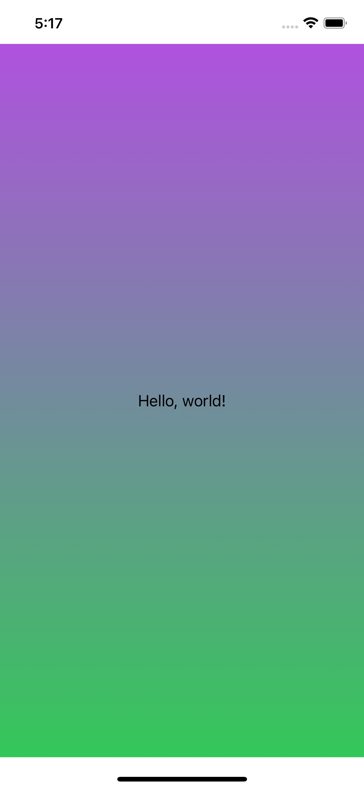
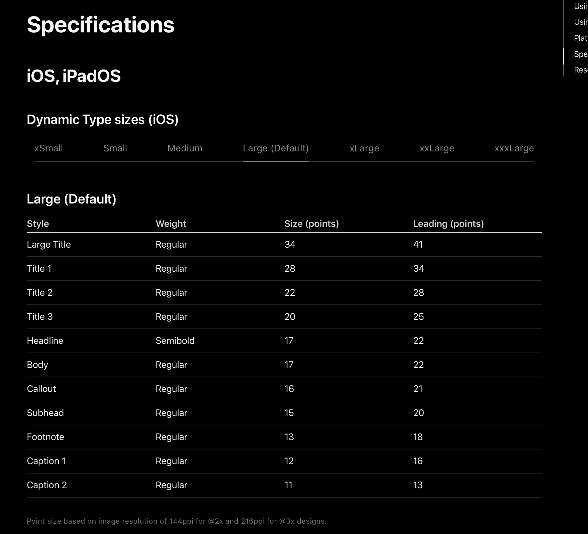
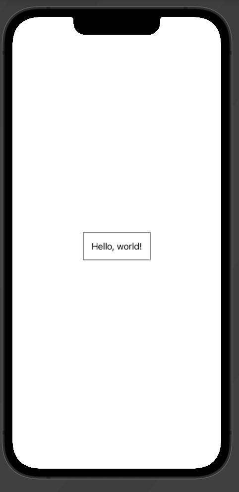
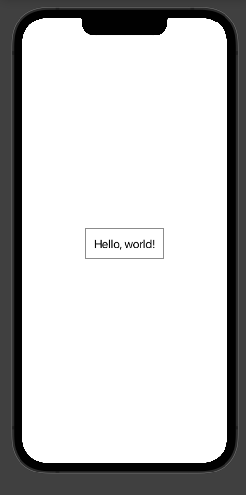
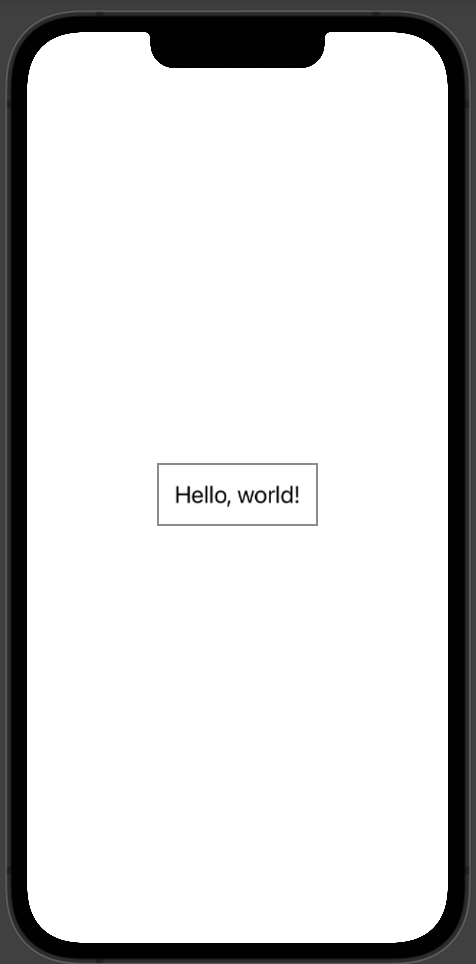
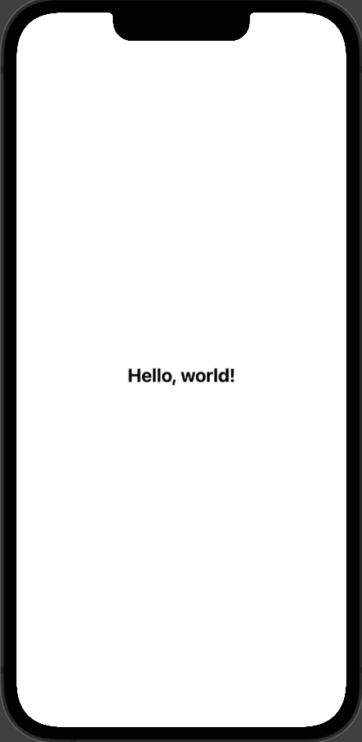
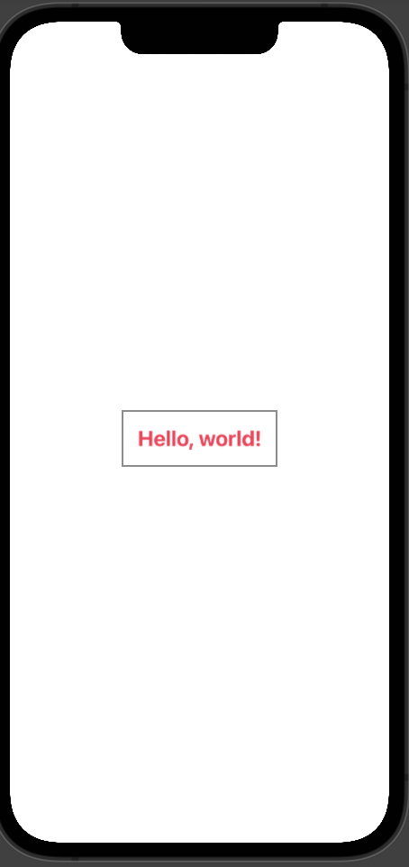
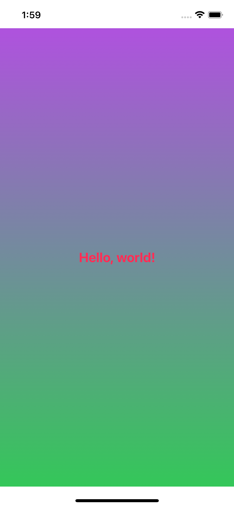

# Intro to View Modifiers, Background Color, and Font Styling

## Intro to View Modifiers
View Modifiers are prevelant in SwiftUI and are defined as anything that conforms to the `ViewModifier` protocol.
    - Declaration
        - ```swift
            protocol ViewModifier
        ``` 

View Modifiers are defined as a modifier you apply to a view or another view modifier, producting a different version of the original value. Basically, its something you can add to a view, that returns a modified version of that view. View Modifiers can also be stacked - you add a font, font-weight, and padding to a view - and it looks different! We'll go into some examples below.

It's also possible to create your own view modifiers - when you have some reusable functionality that you would want to apply to any other views. 


## Background Color

Let's add a background color to our entire application! 

1. First things first, navigate to the top of level of your project, and find `SwiftUI-Sample-Marvel/SwiftUI_Sample_MarvelApp`. Right now, the file should look like this:
    - ```swift
            import SwiftUI
            @main
            struct SwiftUI_Sample_MarvelApp: App {
                var body: some Scene {
                    WindowGroup {
                        ContentView()
                    }
                }
            }
        ```
2. So, backgrounds in SwiftUI are added by being adding the `background(alignment:content:)` view modifier to the top-level view, in this case `ContentView`. The background modifier takes in a specific alignment (defaulting to center), and a specific view. So, lets start with defining the `view` we want for our background.
    - Inside the `SwiftUI_Sample_MarvelApp` struct, create a variable "backgroundGradient" and define it as below:
        - ```swift
              let backgroundGradient = LinearGradient(
                    colors: [Color.purple, Color.green],
                    startPoint: .top, endPoint: .bottom
                )
        ```
    - Next, use that inside the `.background(alignment:content:)` view modifier to the `ContentView()`, and align it to the center like below:
        - ```swift
            var body: some Scene {
                WindowGroup {
                    ContentView()
                        .background(alignment: .center) {
                            backgroundGradient
                        }
                }
            }
        ``` 

3. Run the app and checkout the results! It probably won't look quite right.
    -  
    - What happened? Well, view modifiers only target what you've given it! So there is some weirdness because it is only the background of the `ContentView` View, which only takes up a very small part of the screen. Since the WindowGroup doesn't take on view modifiers - we are going to use something else, a Z-Stack!

4. Use a ZStack, by wrapping everything inside the WindowGroup with it, like below:
    - ```swift
        var body: some Scene {
            WindowGroup {
                ZStack {
                    ContentView()
                    .background(alignment: .center) {
                        backgroundGradient
                    }
                }
            }
        }
    ```

5.  Now, remove the background modifier from ContentView() and add backgroundGradient above the ContentView(), like below:
    - ```swift
            var body: some Scene {
                WindowGroup {
                    ZStack {
                        backgroundGradient
                        ContentView()
                    }
                }
            }
    ```

6. Now run the app again! Congrats! You made a colorful background!
    - 

7. See this final [code here](https://github.com/dfperry5/SwiftUI-Sample-Marvel/commit/f8e456014b70d571948c6a1803748f3c839d2f63).

7. Now, lets learn about a Z-Stack. A Z-Sack is a View where each individual, successive view child view has a higher Z-Axis value than the one preceding it. This means, that in our example if you think about the Z-STack as the depth of the view (going into the screen) - then the `backgroundGradient` we build is the first level, then the `ContentView()` sits "on top" of that gradient.

## Font Styling

### font(_:)

Let's make our "Hello World" within the ContentView be a different font size. Using [Apple's Human Interface Guidelines for Typography](https://developer.apple.com/design/human-interface-guidelines/foundations/typography/), pick a font size that you want to go with, see the list below:
    - 

1. I am going to use `title2`. Open the file `SwiftUI-Sample-Marvel/ContentView.swift`. It should look like this:
    - ```swift
        import SwiftUI
        struct ContentView: View {
            var body: some View {
            Text("Hello, world!")
                .padding()
            }
        }
    ```

2. Now, add the `.font` modifier to the `Text()` view in your code. It should look something like this:
    - ```swift
        import SwiftUI

        struct ContentView: View {
            var body: some View {
            Text("Hello, world!")
                .font(.title2)
                .padding()
            }
        }
    ```

3. Check it out in preview! Great job changing the font-size!
    - The original:
        - 
    - The new font size:
        - 

4. See the complete code for [this section here](https://github.com/dfperry5/SwiftUI-Sample-Marvel/commit/2d922ba52cac819582ed9908582b9c4dc176624d)!

### fontWeight(_:)
Let's continue the process and make our text bold! Return, once more, to the file `SwiftUI-Sample-Marvel/ContentView.swift`.

1. Right now, your view should look like this:
    - ```swift
        struct ContentView: View {
            var body: some View {
                Text("Hello, world!")
                    .font(.title2)
                    .padding()
                }
        }
    ```

2. To update the font weight we need to use the `.fontWeight(_:)` view modifier. It modifies a TextView and takes in a `Font.Weight` parameter. To view the different types of `Font.Weight`'s possible - check out [Apples documentation](https://developer.apple.com/documentation/swiftui/font/weight). Let's try to add it to the code. Underneath the `.font(..)` modifier you added in the previous step - add a new `.fontWeight(.bold)` one like so:
    - ```swift
        struct ContentView: View {
            var body: some View {
                Text("Hello, world!")
                    .font(.title2)
                    .fontWeight(.bold)
                    .padding()
                }
        }
    ```

3. Check out your work in the Preview!
    - Before:
        - 
    - After:
        - 

### foregroundColor(_:)

Great work so far! Let's keep on trucking! This time - lets change the color of our font! Back to our ContentView file - `SwiftUI-Sample-Marvel/ContentView.swift`.

1. At this point your view should look like this:
    - ```swift
        struct ContentView: View {
            var body: some View {
                Text("Hello, world!")
                    .font(.title2)
                    .padding()
                }
        }
    ```

2. To update the color of your text, use the `.foregroundColor(:_)` view modifier. This changes the color of the foreground of any view you add it to. It takes in a `Color` object as a parameter. To view more options - check out the list of [provided color options by Apple](https://developer.apple.com/documentation/swiftui/color). I'm going to make my pink! To do this, add the `.foregroundColor(.pink)` modifier after the `.fontWeight(.bold)` one you added in the previous section. Your code should look like below:
    - ```swift
        struct ContentView: View {
            var body: some View {
                Text("Hello, world!")
                    .font(.title2)
                    .fontWeight(.bold)
                    .foregroundColor(.pink)
                    .padding()
            }
        }
    ``` 

3. Check it out in preview! You've done some really awesome work!
     - Before:
        - 
     - After:
        - 


## Conclusion

This section was really intended for you to get familiar with Preview, Running your app, and playing around with View Modifiers. Next, we're going to dive into the creation of the App! Before that though, take a look at your beautiful product! For me, it looks like:
    - 


