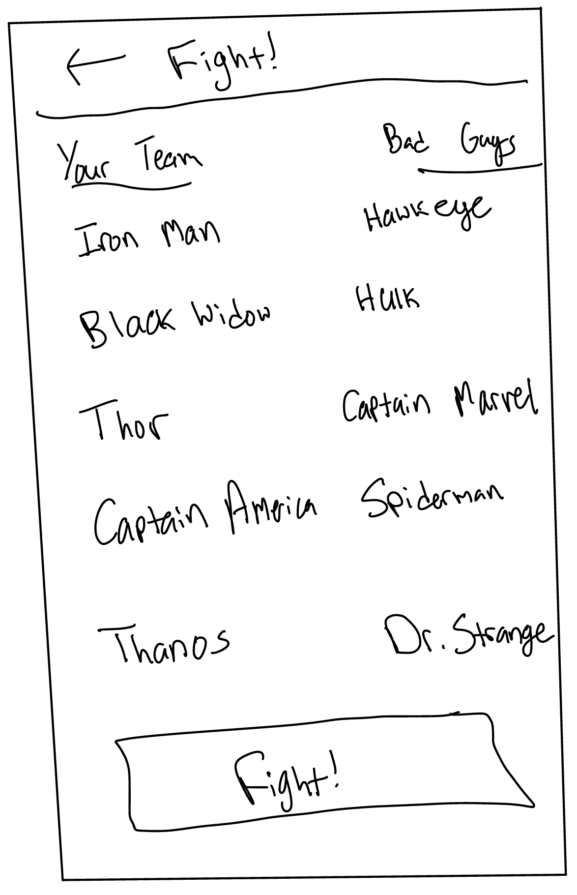

# Beginning the UI

## Wireframes

When beginning a UI (User Interface) of any sort, it's helpful to begin wireframes. Check out mine below!

The Home Screen!
    - 

Begin game
    - 

Select team
    - 

Battle
    - 

Results
    - 