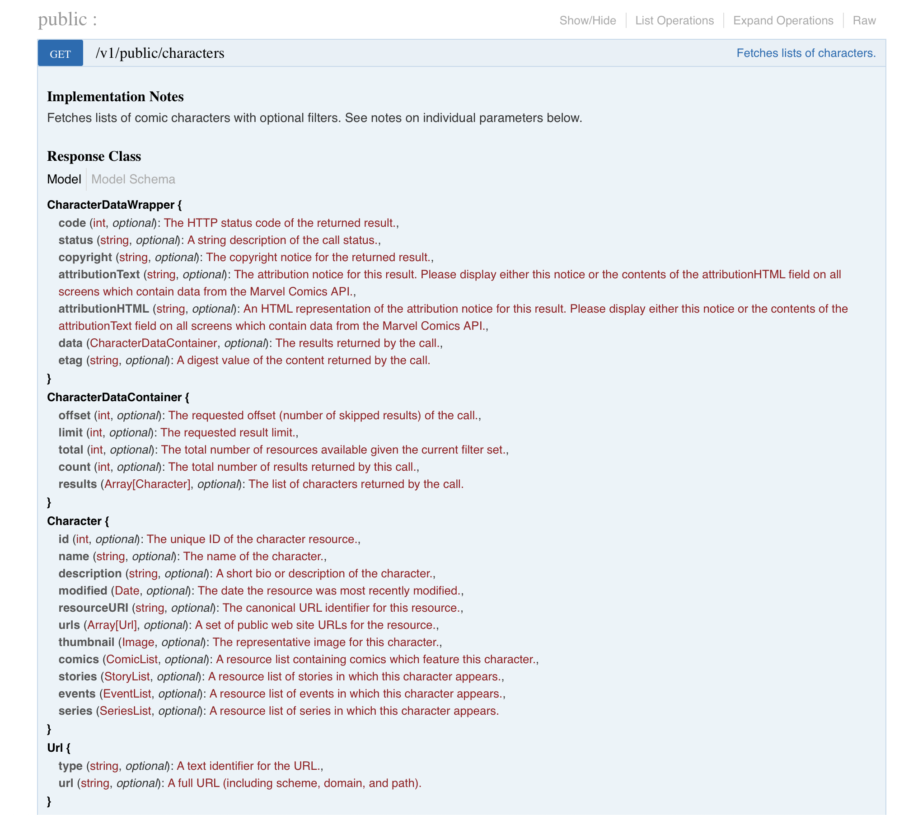
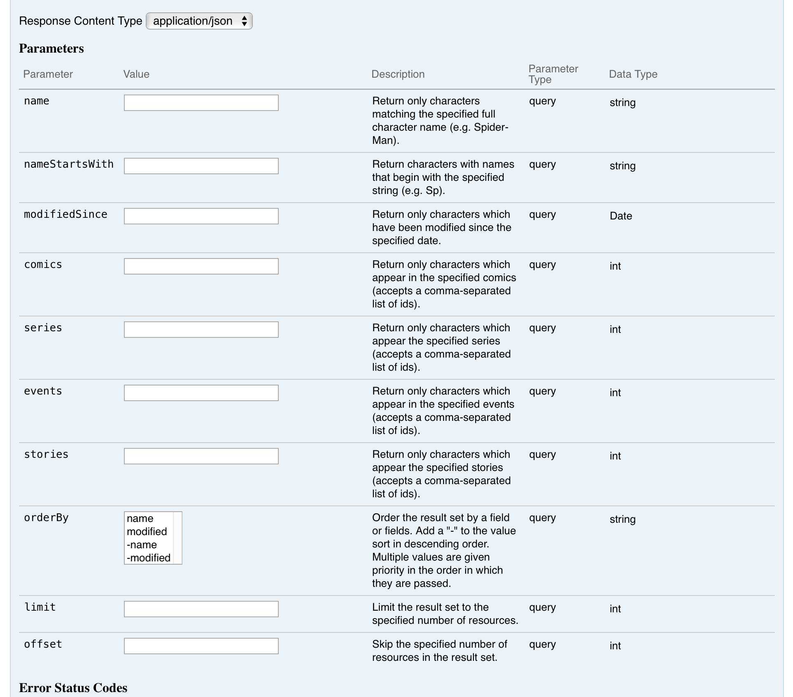
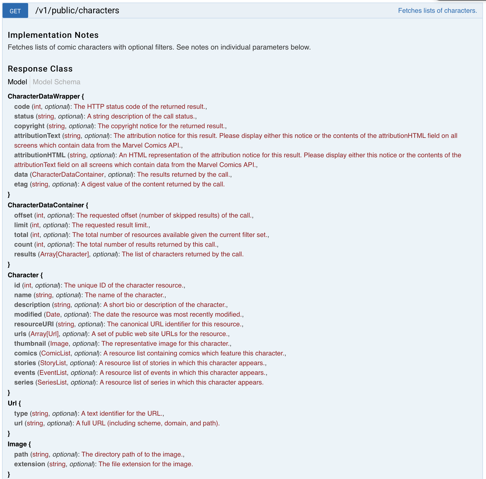

# The Marvel Public API

### Get Your Keys
1. Navigate to https://developer.marvel.com/account, create a free account and retrieve your public and private keys. The folks at Marvel are kind enough to give you a maximum of 3000 calls / day.

2. Next, lets check out [Marvel's interactive documentation](https://developer.marvel.com/docs). We're going to focus on the `/v1/public/character` API, in this section.
    - This API wil return you a list of comic book characters, with a good amount of detail about each character. There is also a lot of documentation on the structure of the response which will be important when we begin to create `Models`, or objects in our Swift Code that represent this API Response. But, more on that later.
    - 


3. Let's investigate this API a little more. As you scroll down, you'll see a list of parameters.
    - 
    - This tells you what you can pass in to change or update the response. The one missing is your API Secret / Public - the tool is automatically adding it for you. So try it out, and have fun!

4. Now, lets make this call from your application.


## Connecting To Marvel API

1. Launch your project. Once XCode opens up, go ahead and create a folder/group named `Services` at the same level as your `ContentView.swift`. After this, create another folder/group inside of `Services` and name it `MarvelService`. Now, we will need to create 3 Swift files:
    - MarvelService.swift
    - MarvelService+Config.swift
    - MarvelService+Models.swift

2. Let's begin filling out these files. First, lets start with MarvelService.swift.
    - For now, just create a basic struct in the file named Marvel Service. It should look like:
        - ```swift
                public struct MarvelService {}
            ```
    - For now, we will leave this as it.

3. Next, let's update the file `MarvelService+Config.swift`.
    - In this file. we're going to store configurations, and extend the Marvel Service struct you just defined. The configuration will hold 3 values: `privateKey`, `publicKey`, and `URL`.
        - The `privateKey` and `publicKey `should be what you retrieved from the Marvel Developer site. You should not commit these values to your repo.
        - the `URL` will be the URL of the API we want to call - in this case: "https://gateway.marvel.com:443/v1/public/characters"
    - Now, we're going to do this with some code, like below. First, declare a public extension to the MarvelService struct. Then, declare a public enum inside of it named `Config`. Inside that enum, declare the three valuese we mentioned above (privateKey, publicKey, URL) as public static constants, using the `let` keyword. 
        - ```swift
                public extension MarvelService {
                    enum Config {
                        public static let publicKey = "Your Public Key Here"
                        public static let privateKey = "Your Private Key Here"
                        public static let URL = "https://gateway.marvel.com:443/v1/public/characters"
                    }
                }
            ```

4. Finally, let's fill out the MarvelService+Models.swift file. Before we get to that though, revisit the [Marvel API Documentation](https://developer.marvel.com/docs#!/public/getCreatorCollection_get_0) for the `/v1/public/characters` API.
    - The documentation shows the basic structure of the response with some definitions of the values and what they represent. In our models file, we will need to create these structures (seen below).
        - 
    - In the code, we will define each entry (`CharacterDataWrapper`, `CharacterDataContainer`, `Character`, and eventually a flavor of `Image`). All of these will conform to the `Codable` protocol which means that Swift will automatically translate JSON into a Swift object.

5. Let's add code for the first 3 types - `CharacterDataWrapper`, `CharacterDataContainer`, and `Character`. It'll look something like this:
    - ```swift
      struct Character: Codable {
            public let id: Int
            public let name: String
            public let description: String
            public let thumbnail: MarvelImage
        }

        struct CharacterDataContainer: Codable {
            public let offset: Int
            public let limit: Int
            public let total: Int
            public let count: Int
            public let results: [Character]
        }

        struct CharacterDataWrapper: Codable {
            public let code: Int
            public let status: String
            public let data: CharacterDataContainer
        }
        ```
    - Note the use of `MarvelImage`, where you may expect `Image` to be - the reason is that `Image` is a reserved word in Swift. We will use `MarvelImage` to represent the Image type in the Marvel response.

6. Now, adding in the MarvelImage struct will be a bit more tricky. First, define the struct.
    - ```swift
            struct MarvelImage: Codable { }
        ```
    - Now, one of the attributes of the `MarvelImage` (or just Image in the Marvel Developer docs) is named `extension`. This is, once again, a protected word in Swift. So we will need to use coding keys to get around this. This will end up looking like the code below - add this snippet inside the `Models` enum, where you added different types.
    - ```swift
        struct MarvelImage: Codable {
            public let path: String
            public let imageExtension: String
            enum CodingKeys: String, CodingKey {
                case path
                case imageExtension = "extension"
            }
        }
        ```
    - Notice the use of Coding Keys - where we define that the `imageExtension` attribute of the `MarvelImage` struct - corresponds to the `extension` attribute on the `Image` in the Marvel documentation.

## Calling the Service